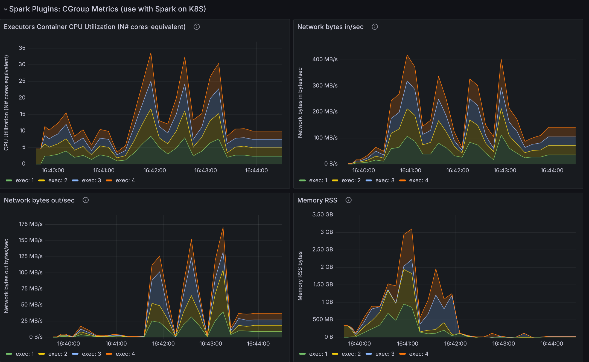
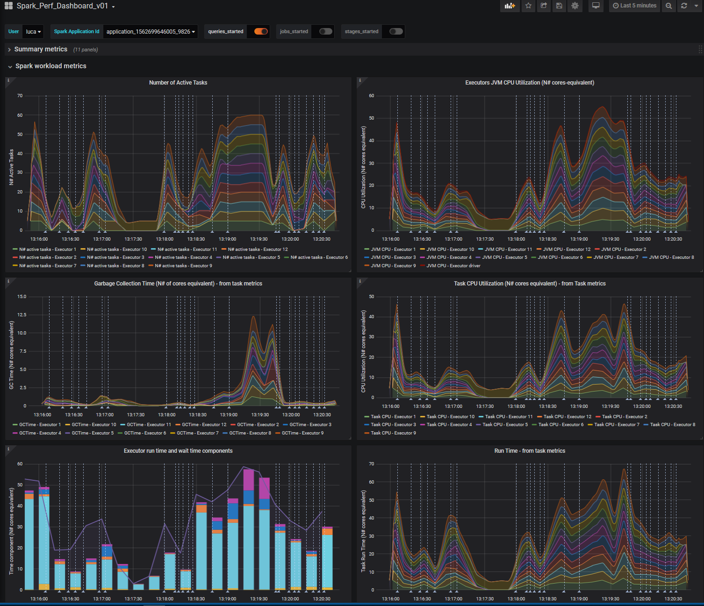

## How to build and deploy a Performance Dashboard for monitoring Apache Spark

This note outlines the main steps for building a performance dashboard for Apache Spark.

### Key Features
- You can find here all the components to deploy a monitoring application for Apache Spark
- Spark-dashboard collects metrics from Spark and visualizes them in a Grafana   
- This tool is intended for performance troubleshooting and DevOps monitoring of Spark workloads.
- Use it with Spark 2.4 and higher (3.x)

### Deploy using container technology
- [Spark Dashboard](https://github.com/cerndb/spark-dashboard) is a repository that contains code and instructions to streamline the deployment of the Spark dashboard using InfluxDB and Grafana using container technology.

## Understanding the architecture


This technical drawing outlines an integrated monitoring pipeline for Apache Spark using open-source components. The flow of the diagram illustrates the following components and their interactions:
- **Apache Spark's metrics:** This is the source of metrics data: [Spark metrics system](https://spark.apache.org/docs/latest/monitoring.html#metrics). Spark's executors and the driver emit metrics such 
  as executors' run time, CPU time, garbage collection (GC) time, memory usage, shuffle metrics, I/O metrics, and more.
  Spark metrics are exported in Graphite format by Spark and then ingested by Telegraf. 
- **Telegraf:** This component acts as the metrics collection agent (the sink in this context). It receives the
   metrics emitted by Apache Spark's executors and driver, and it adds labels to the measurements to organize 
   the data effectively. Telegraf send the measurements to VitoriaMetrics for storage and later querying.
- **VictoriaMetrics:** This is a time-series database that stores the labeled metrics data collected by Telegraf. 
  The use of a time-series database is appropriate for storing and querying the type of data emitted by 
  monitoring systems, which is often timestamped and sequential.
- **Grafana:** Finally, Grafana is used for visualization. It reads the metrics stored in VictoriaMetrics 
  using PromQL/MetricsQL, which is a query language for time series data in Prometheus. Grafana provides
  dashboards that present the data in the form of metrics and graphs, offering insights into the performance
  and health of the Spark application.

Note: spark-dashboard v1 (the original implementation) uses InfluxDB as the time-series database, see also
[spark-dashabord v1 architecture](https://raw.githubusercontent.com/LucaCanali/Miscellaneous/master/Spark_Dashboard/images/Spark_metrics_dashboard_arch.PNG)

## Simplified configuration and rollout
- The repository [Spark Dashboard](https://github.com/cerndb/spark-dashboard) has code and instructions to streamline
  the deployment of the Spark dashboard using container technology (the repo
  has Docker implementations and an implementation with Helm)
- The steps below show how to do the configuration if you prefer to install it yourself

## Manual config

###  Step 1: Install and configure Telegraf and VictoriaMetrics
- Download and install Telegraf from https://www.influxdata.com/time-series-platform/telegraf/
- **Key step:** Setting up the templates configuration
  - Edit the config file as in the provided example [telegraf.conf](telegraf.conf)
  - this provides a graphite endpoint for ingesting data from Spark metrics
  - it adds the necessary tags
  - it exports the metrics to VictoriaMetrics
  - Start/restart Telegraf with: `service telegraf start`
- If needed, open the firewall port (port 2003 for graphite)
- Download and install VictoriaMetrics from https://victoriametrics.com
  - Start/restart VictoriaMetrics with: `./victoria-metrics-prod` 

###  Original/obsolete version (v1) of Step 1: Install and configure InfluxDB
- The first version of this used InfluxDB 1.x, this is not recommended for new installations
- Download and install InfluxDB from https://www.influxdata.com
  - Note: this requires InfluxDB v1.x as it has a Graphite endpoint which has been removed in InfluxDB 2.x
- Edit the config file `/etc/influxdb/influxdb.conf` and enable the graphite endpoint
- **Key step:** Setting up the templates configuration
  - This instructs InfluxDB on how to map data received on the graphite endpoint to the measurements and tags in the DB
  - The configuration used for this work is provided at: [influxDB graphite endpoint configuration snippet](influxdb.conf_GRAPHITE)  
- Optionally configure other InfluxDB parameters of interest as data location and retention
- Start/restart influxDB service: systemctl restart influxdb.service
- If needed, open the firewall port (port 2003 by default)

###  Step 2: Configure Grafana and prepare/import the dashboard
- Download and install Grafana 
  - download the rpm from https://grafana.com/ and start Grafana service: `service grafana-server start`
  - alternative: run Grafana on a Docker container: http://docs.grafana.org/installation/docker/
- Install the Grafana datasource for VictoriaMetrics https://github.com/VictoriaMetrics/grafana-datasource
- Connect to the Grafana web interface as admin and configure
  - By default: http://yourGrafanaMachine:3000
  - If needed, open the firewall port (port 3000 by default) 
  - Create a data source to connect to VictoriaMetrics 
    - Set the http URL with the correct port number, default: http://yourVictoriaMetricsMachine:8428
  - **Key step:** Prepare the dashboard. 
    - Get started by importing the example Grafana dashboard [Spark_Perf_Dashboard_v04_PromQL](Spark_Perf_Dashboard_v04_PromQL.json)
    - Consider experimenting with building your dashboard or improving on the provided examplse.

### Step 3: Prepare Spark configuration to sink metrics to graphite endpoint in InfluxDB
You need Spark configuration to "point" Spark to collecting the metrics and sinking them to the Graphite end point.  
There are a few alternative ways on how to do this, depending on your environment and preferences:
  - One way is to specify a list of Spark configuration parameters of the type `spark.metrics.conf.xxx`.
   The configurations parameters can be specified in mulitple ways, as usual with Spark, for example:
   spark-submit with --conf, or when allocating the SparkSession programmatically, or can be set in `spark-defaults.conf` 
   - The (**recommended**) way to start experimenting is by editing the file `$SPARK_CONF_DIR/metrics.properties`  
Configuration for the metrics sink need to be provided to all the components being traced
(each component will connect directly to the sink).
See details at [Spark_metrics_config_options](Spark_metrics_config_options.md)
Example Spark configuration:  

  ```
  # Add this to metrics.properties 
  *.sink.graphite.host=localhost
  *.sink.graphite.port=2003
  *.sink.graphite.period=10
  *.sink.graphite.unit=seconds
  *.sink.graphite.prefix=lucatest
  *.source.jvm.class=org.apache.spark.metrics.source.JvmSource
  ```

Additional configuration, that you should pass as command line options (or add to spark-defaults.conf): 
```
--conf spark.metrics.staticSources.enabled=true
--conf spark.metrics.appStatusSource.enabled=true
```

Instead of using metrics.properties, you may prefer to use Spark configuration options directly.
It's a matter of convenience and depends on your use case. This is an example of how to do it:  
```
# InfluxDB endpoint, point to the host where the InfluxDB container is running
INFLUXDB_ENDPOINT=`hostname`

bin/spark-shell (or spark-submit or pyspark)
--conf "spark.metrics.conf.*.sink.graphite.class"="org.apache.spark.metrics.sink.GraphiteSink" \
--conf "spark.metrics.conf.*.sink.graphite.host"=$INFLUXDB_ENDPOINT \
--conf "spark.metrics.conf.*.sink.graphite.port"=2003 \
--conf "spark.metrics.conf.*.sink.graphite.period"=10 \
--conf "spark.metrics.conf.*.sink.graphite.unit"=seconds \
--conf "spark.metrics.conf.*.sink.graphite.prefix"="lucatest" \
--conf "spark.metrics.conf.*.source.jvm.class"="org.apache.spark.metrics.source.JvmSource" \
--conf "spark.metrics.staticSources.enabled"=true \
--conf "spark.metrics.appStatusSource.enabled"=true
```

Optional configuration if you want to display "Tree Process Memory Details":
```
--conf spark.executor.processTreeMetrics.enabled=true
```

### Step 4: Start using the dashboard
- Run Spark workload, for example run Spark shell (with the configuration parameters of Step 3)
  - An example of workload to see some values populated in the dashboard is to run a query as: 
`spark.time(sql("select count(*) from range(10000) cross join range(1000) cross join range(100)").show)`

- You can use the [TPCDS_PySpark](https://github.com/LucaCanali/Miscellaneous/tree/master/Performance_Testing/TPCDS_PySpark)
package to generate a TPC-DS workload and test the dashboard.

- Example of running TPCDS on a YARN Spark cluster, monitor with the Spark dashboard:
```
TPCDS_PYSPARK=`which tpcds_pyspark_run.py`

spark-submit --master yarn --conf spark.log.level=error --conf spark.executor.cores=8 --conf spark.executor.memory=64g \
--conf spark.driver.memory=16g --conf spark.driver.extraClassPath=tpcds_pyspark/spark-measure_2.12-0.24.jar \
--conf spark.dynamicAllocation.enabled=false --conf spark.executor.instances=32 --conf spark.sql.shuffle.partitions=512 \
$TPCDS_PYSPARK -d hdfs://<PATH>/tpcds_10000_parquet_1.13.1
```

- Example of running TPCDS on a Kubernetes cluster with S3 storage, monitor this with the extended dashboard using Spark plugins:
```
TPCDS_PYSPARK=`which tpcds_pyspark_run.py`

spark-submit --master k8s://https://xxx.xxx.xxx.xxx:6443 --conf spark.kubernetes.container.image=<URL>/spark:v3.5.1 --conf spark.kubernetes.namespace=xxx \
--conf spark.eventLog.enabled=false --conf spark.task.maxDirectResultSize=2000000000 --conf spark.shuffle.service.enabled=false --conf spark.executor.cores=8 --conf spark.executor.memory=32g --conf spark.driver.memory=4g \
--packages org.apache.hadoop:hadoop-aws:3.3.4,ch.cern.sparkmeasure:spark-measure_2.12:0.24,ch.cern.sparkmeasure:spark-plugins_2.12:0.3 --conf spark.plugins=ch.cern.HDFSMetrics,ch.cern.CgroupMetrics,ch.cern.CloudFSMetrics \
--conf spark.cernSparkPlugin.cloudFsName=s3a \
--conf spark.dynamicAllocation.enabled=false --conf spark.executor.instances=4 \
--conf spark.hadoop.fs.s3a.secret.key=$SECRET_KEY \
--conf spark.hadoop.fs.s3a.access.key=$ACCESS_KEY \
--conf spark.hadoop.fs.s3a.endpoint="https://s3.cern.ch" \
--conf spark.hadoop.fs.s3a.impl="org.apache.hadoop.fs.s3a.S3AFileSystem" \
--conf spark.executor.metrics.fileSystemSchemes="file,hdfs,s3a" \
--conf spark.hadoop.fs.s3a.fast.upload=true \
--conf spark.hadoop.fs.s3a.path.style.access=true \
--conf spark.hadoop.fs.s3a.list.version=1 \
$TPCDS_PYSPARK -d s3a://luca/tpcds_100
```

### Test the dashboard

The configuration is finished, now you can test the dashboard.
Run Spark using the configuration as in Step 4 and start a test workload.
Open the web page of the Grafana dashboard:

- A drop-down list should appear on top left of the dashboard page, select the application you want to monitor. 
Metrics related to the selected application should start being populated as time and workload progresses.
- If you use the dashboard to measure a workload that has already been running for some time,
note to set the Grafana time range selector (top right of the dashboard) to a suitable time window
- For best results test this using Spark 3.x
(note Spark 2.4 and 2.3 will also work, but it will not populate all the graphs/metrics)
- The instrumentation works with Spark running on a cluster manager (for example YARN or Kubernetes).
  Use this instrumentation for Spark in local mode only with Spark 3.1 or higher.

**Dashboard view:** The following links show an example and general overview of the example dashboard,
measuring a test workload.
You can find there a large number of graphs and gauges, however that is still a small selection
 of the [available metrics in Spark instrumentation](Spark_dropwizard_metrics_info.md).
For reference, the test workload is 
 [Spark TPCDS benchmark](https://github.com/databricks/spark-sql-perf) at scale 100 GB, running on a test 
 YARN cluster, using 24 executors, with 5 cores and 12 GB of RAM each.
  - Dashboard part 1: [Summary metrics](images/dashboard_part1_summary.PNG)
  - Part 2: [Workload metrics](images/dashboard_part2_workload.PNG)
  - Part 3: [Memory metrics](images/dashboard_part3_memory.PNG)
  - Part 4: [I/O metrics](images/dashboard_part4_IO.PNG)  


### Spark metrics dashboard with query/job/stage annotations

**Main ideas:** 
- Grafana "[annotations provide a way to mark points on the graph with rich events](https://grafana.com/docs/reference/annotations/)".
- You can use this to mark important point in the
graph, with details about the start or end time of queries, jobs, stages.
- Grafana allows to add annotation [queries using an InfluxDB source](https://grafana.com/docs/features/datasources/influxdb/#annotations) 
- If you log the query/job/stage start and time into an InfluxDB instance, you can use that information as
a data source to add annotation to the Grafana dashboard. 
- The motivation for this is that it allows you to relate
metrics and resource utilization with meaningful data about the workload and answer questions like:
which query/Spark job caused the CPU utilization spike at time X? How much shuffle did I use for a given job? etc. 

**Recipe** to add Spark query/job/stage information to the Spark performance dashboard:
- Log Spark execution information (query/job/stage start and end time) to an InfluxDB instance.
For this use [sparkMeasure](https://github.com/LucaCanali/sparkMeasure) in Flight recorder mode
with [InfluxDB Sink](https://github.com/LucaCanali/sparkMeasure/blob/master/docs/Flight_recorder_DBwrite.md)
as in this example:
```
bin/spark-shell --master local[*] --packages ch.cern.sparkmeasure:spark-measure_2.12:0.24 \
--conf spark.sparkmeasure.influxdbURL="http://myInfluxDB:8086" 
--conf spark.extraListeners=ch.cern.sparkmeasure.InfluxDBSink
```

- Import the [example Grafana dashboard_with_annotations](Spark_Perf_Dashboard_v03_with_annotations.json)
and set up the data source for annotations to point to the InfluxDB instance.
  The DB name used by sparkMeasure by default is "sparkmeasure"
 
- An example of the results is show below (see "Example Grafana dashboard with annotations")

### Run in a standalone Docker container or on Kubernetes using a Helm Chart

The repository [**spark-dashboard**](https://github.com/cerndb/spark-dashboard) supports the installation
of the Spark Performance Dashboard using containers technology.  
Two different installation options are packaged in the repository, use the one that suits your environment best:
- [dockerfiles_v2](https://github.com/cerndb/spark-dashboard/tree/master/dockerfiles_v2) -> Docker build files for a Docker container image, use this to deploy the Spark Dashboard using Docker
- [dockerfiles v1](https://github.com/cerndb/spark-dashboard/tree/master/dockerfiles_v1) -> Version 1 of the Docker container image, using InfluxDB as the time-series database
- [charts v1](https://github.com/cerndb/spark-dashboard/tree/master/charts_v1) -> a Helm chart for deploying the Spark Dashboard on Kubernetes

### Example Graphs

The next step is to further drill down in understanding Spark metrics, the dashboard graphs
and in general investigate how the dashboard can help you troubleshoot your application
performance. One way to start is to run a simple workload that you can understand and reproduce.
In the following you will find example graphs from a simple Spark SQL query reading a Parquet table from HDFS.
- The query used is `spark.sql("select * from web_sales where ws_list_price=10.123456").show`
- `web_sales` is a 1.3 TB table from the Spark [TPCDS benchmark](https://github.com/databricks/spark-sql-perf) generated at scale 10000.
- What the query does is reading the entire table, applying the given filter and finally returning an empty result set.
This query is used as a "trick to the Spark engine" to force a full read of the table and intentionally avoiding optimization, like Parquet filter pushdown. 
- This follows the discussion of [Diving into Spark and Parquet Workloads, by Example](https://db-blog.web.cern.ch/blog/luca-canali/2017-06-diving-spark-and-parquet-workloads-example) 
- Infrastructure and resources allocated: the Spark Session ran on a test YARN cluster,
using 24 executors, with 5 cores and 12 GB of RAM each.

**Graph: Number of Active Tasks**  
  
One key metric when troubleshooting distributed workloads is the graph of the number of active sessions as a
function of time.
This shows how Spark is able to make use of the available cores allocated by the executors.

**Graph: JVM CPU Usage**  
    
CPU used by the executors is another key metric to understand the workload.
The dashboard also reports the [CPU consumed by tasks](images/Graph_task_CPU_time.PNG), the difference is that the
CPU consumed by the JVM includes for example of the CPU used by Garbage collection and more.  
Garbage collection can take an important amount of time, in particular when processing large amounts of data
 as in this case, see [Graph: JVM Garbage Collection Time](images/Graph_garbage_collection.PNG "JVM Garbage Collection Time")

**Graph: Time components**  
  
Decomposing the run time in component run time and/or wait time can be of help to pinpoint the bottlenecks.
In this graph you can see that CPU time and Garbage collection are important components of the workload.
A large component of time, between the "executor run time" and the sum of "cpu time and GC time" is not instrumented.
From previous studies and by knowing the workload, we can take the educated guess that this is the read time.
See also the discussion at [Diving into Spark and Parquet Workloads, by Example](https://db-blog.web.cern.ch/blog/luca-canali/2017-06-diving-spark-and-parquet-workloads-example)

**Graph: HDFS read throughput**  
   
Reading from HDFS is an important part of this workload.
In this graph you can see the measured throughput using HDFS instrumentation exported via the Spark metrics system
into the dashboard.

---
Examples of specialized dashboards

**Example of the CGROUP metrics instrumentation with Spark Plugins**

This is an example of the CGROUP metrics instrumentation with Spark Plugins.
The metrics are captured from the CGroup stats where Spark runs (Spark on Kubernetes) and show container
metrics values for CPU usage, network traffic, and memory usage.

**Example Grafana dashboard with query time annotations**  

This picture shows an example of Grafana dashboard displaying Spark metrics and augmented with annotations
of query start time. Each vertical line is a new query being run. Details on the query id can be found
by drilling down on the graphs. Details on how this is run are describe above at "Spark metrics dashboard with query/job/stage annotations".
