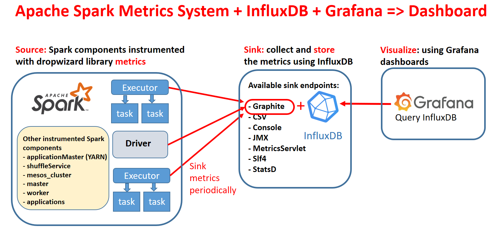
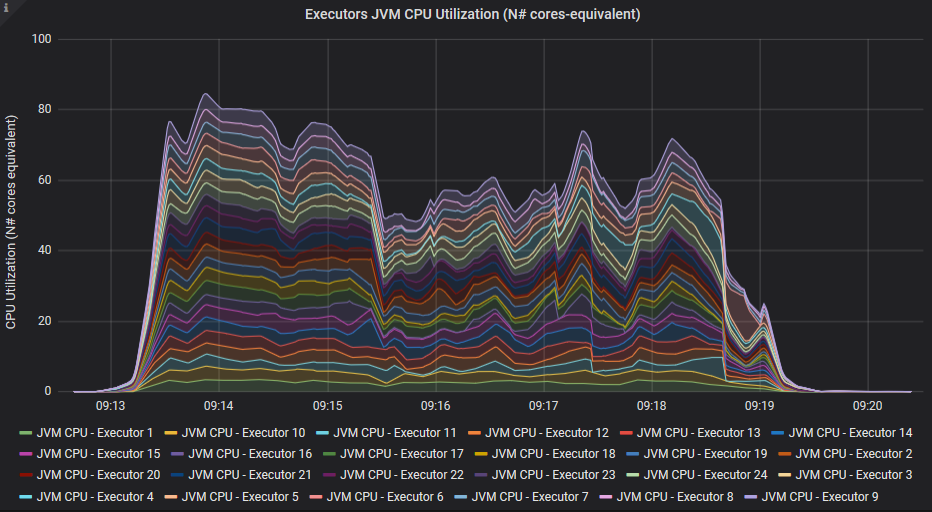

## Build an Online Performance Dashboard for Apache Spark

This note outlines the main steps in building a performance dashboard for Apache Spark
using InfluxDB and Grafana. The dashboard is useful for performance troubleshooting and
online monitoring. 

### Step 1: Understand the architecture


Spark is instrumented with the [Dropwizard/Codahale metrics library](https://metrics.dropwizard.io).
Several components of Spark are instrumented with metrics, see also the 
[spark monitoring guide](https://spark.apache.org/docs/latest/monitoring.html#metrics), 
notably the driver and executors components are instrumented with multiple metrics each.
In addition, Spark provides various sink solutions for the metrics. 
This work makes use of the Spark graphite sink and utilizes InfluxDB with a graphite 
endpoint to collect the metrics. Finally, Grafana is used for querying InfluxDB and 
plotting the graphs (see architectural diagram below).
An important architectural detail of the metrics system is that the metrics are sent directly
from the sources to the sink. This is important when running in distributed mode.
Each Spark executor, for example, will sink directly the metrics to InfluxDB.
By contrast, the WebUI/Eventlog instrumentation of Spark uses the Spark Listener Bus and metrics
flow through the driver in that case 
([see this link](https://raw.githubusercontent.com/LucaCanali/sparkMeasure/master/docs/sparkMeasure_architecture_diagram.png)
for further details).
The number of metrics instrumenting Spark components is quite large. 
You can find a [list of the available metrics at this link](Spark_dropwizard_metrics_info.md)

### Step 2: Install and configure InfluxDB
- Download and install InfluxDB from https://www.influxdata.com
  - Note: tested in Feb 2019 with InfluxDB version 1.7.3
- Edit the config file `/etc/influxdb/influxdb.conf` and enable the graphite endpoint
- **Key step:** Setup the templates configuration
  - This instructs InfluxDB on how to map data received on the graphite endpoint to the measurements and tags in the DB
  - The configuration used for this work is provided at: [influxDB graphite endpoint configuration snippet](influxdb.conf_GRAPHITE)  
- Optionally configure other influxDB parameters of interest as data location and retention
- Start/restart influxDB service: systemctl restart influxdb.service

###  Step 3: Configure Grafana and prepare/import the dashboard
- Download and install Grafana 
  - download rpm from https://grafana.com/ and start Grafana service: `systemctl start grafana-server.service`
  - Note: tested in Feb 2019 using Grafana 6.0.0 beta.
- Alternative: run Grafana on a Docker container: http://docs.grafana.org/installation/docker/
- Connect to the Grafana web interface as admin and configure
  - By default: http://yourGrafanaMachine:3000
  - Create a data source to connect to InfluxDB. 
    - Set the http URL with the correct port number, default: http://yourInfluxdbMachine:8086
    - Set the influxDB database name: default is graphite (no password)
  - **Key step:** Prepare the dashboard. 
    - To get started import the [example Grafana dashboard](Spark_Perf_Dashboard_v01.json)
    - You can also experiment with building your dashboard or augmenting the example.

### Step 4: Prepare Spark configuration to sink metrics to graphite endpoint in InfluxDB
There are a few alternative ways on how to do this, depending on your environment and preferences.
One way is to set a list of configuration parameters of the type `spark.metrics.conf.xx`
another is editing the file `$SPARK_CONF_DIR/metrics.properties`
Configuration for the metrics sink need to be provided to all the components being traced
(each component will connect directly to the sink).
See details at [Spark_metrics_config_options](Spark_metrics_config_options.md)
Example:  
  ```
  spark-submit/spark-shell/pyspark
  --conf "spark.metrics.conf.*.sink.graphite.class"="org.apache.spark.metrics.sink.GraphiteSink" \
  --conf "spark.metrics.conf.*.sink.graphite.host"="graphiteEndPoint_influxDB_hostName>" \
  --conf "spark.metrics.conf.*.sink.graphite.port"=<graphite_listening_port> \
  --conf "spark.metrics.conf.*.sink.graphite.period"=10 \
  --conf "spark.metrics.conf.*.sink.graphite.unit"=seconds \
  --conf "spark.metrics.conf.*.sink.graphite.prefix"="lucatest" \
  --conf "spark.metrics.conf.*.source.jvm.class"="org.apache.spark.metrics.source.JvmSource"
  ```

### Step 5: Start using the dashboard
- Run Spark workload, for example run Spark shell (with the configuration parameters of Step 3)
  - An example of workload to see some values populated in the dashboard is to run a query as: 
`spark.time(sql("select count(*) from range(10000) cross join range(1000) cross join range(100)").show)`
  - Another example is to run TPCDS benchmark, see https://github.com/databricks/spark-sql-perf

The configuration is finished, now you can test the dashboard.
Run Spark using the configuration as in Step 4 and start a test workload.
Open the web page of the Grafana dashboard:

- A drop-down list should appear on top left of the dashboard page, select the application you want to monitor. 
Metrics related to the selected application should start being populated as time and workload progresses.
- If you use the dashboard to measure a workload that has already been running for some time,
note to set the Grafana time range selector (top right of the dashboard) to a suitable time window
- For best results test this using Spark 2.4.0 or higher
(note Spark 2.3.x will also work, but it will not populate executor JVM CPU)
- Avoid local mode and use Spark with a cluster manager (for example YARN or Kubernetes) when
testing this. Most of the interesting metrics are in the executor source, which is not populated 
in local mode (up to Spark 2.4.0 included). 
- If you want to "kick the tires" of the dashboard, 

**Dashboard view:** The following links show an example and general overview of the example dashboard,
measuring a test workload.
You can find there a large number of graphs and gauges, however that is still a small selection
 of the [available metrics in Spark instrumentation](Spark_dropwizard_metrics_info.md).
For reference, the test workload is 
 [Spark TPCDS benchmark](https://github.com/databricks/spark-sql-perf) at scale 100 GB, running on a test 
 YARN cluster, using 24 executors, with 5 cores and 12 GB of RAM each.
  - Dashboard part 1: [Summary metrics](images/dashboard_part1_summary.PNG)
  - Part 2: [Workload metrics](images/dashboard_part2_workload.PNG)
  - Part 3: [Memory metrics](images/dashboard_part3_memory.PNG)
  - Part 4: [I/O metrics](images/dashboard_part4_IO.PNG)  


### Example Graphs

The next step is to further drill down in understanding Spark metrics, the dashboard graphs
and in general investigate how the dashboard can help you troubleshoot your application
performance. One way to start is to run a simple workload that you can understand and reproduce.
In the following you will find example graphs from a simple Spark SQL query reading a Parquet table from HDFS.
- The query used is `spark.sql("select * from web_sales where ws_list_price=10.123456").show`
- `web_sales` is a 1.3 TB table from the Spark TPCDS benchmark](https://github.com/databricks/spark-sql-perf) generated at scale 10000.
- What the query does is reading the entire table, applying the given filter and finally returning an empty result set.
This query is used as a "trick to the Spark engine" to force a full read of the table and intentionally avoiding optimization, like Parquet filter pushdown. 
- This follows the discussion of [Diving into Spark and Parquet Workloads, by Example](https://db-blog.web.cern.ch/blog/luca-canali/2017-06-diving-spark-and-parquet-workloads-example) 
- Infrastructure and resources allocated: the Spark Session ran on a test YARN cluster,
using 24 executors, with 5 cores and 12 GB of RAM each.

**Graph: Number of Active Tasks**
  
One key metric when troubleshooting distributed workloads is the graph of the number of active sessions as a
function of time.
This shows how Spark is able to make use of the available cores allocated by the executors.

**Graph: JVM CPU Usage**
    
CPU used by the executors is another key metric to understand the workload.
The dashboard also reports the [CPU consumed by tasks](images/Graph_task_CPU_time.PNG), the difference is that the
CPU consumed by the JVM includes for example of the CPU used by Garbage collection and more.  
Garbage collection can take an important amount of time, in particular when processing large amounts of data
 as in this case, see [Graph: JVM Garbage Collection Time](images/Graph_garbage_collection.PNG "JVM Garbage Collection Time")

**Graph: Time components**
  
Decomposing the run time in component run time and/or wait time can be of help to pinpoint the bottlenecks.
In this graph you can see that CPU time and Garbage collection are important components of the workload.
A large component of time, between the "executor run time" and the sum of "cpu time and GC time" is not instrumented.
From previous studies and by knowing the workload, we can take the educated guess that this is the read time.
See also the discussion at [Diving into Spark and Parquet Workloads, by Example](https://db-blog.web.cern.ch/blog/luca-canali/2017-06-diving-spark-and-parquet-workloads-example)

**Graph: HDFS read throughput**
   
Reading from HDFS is an important part of this workload.
In this graph you can see the measured throughput using HDFS instrumentation exported via the Spark metrics system
into the dashboard.

