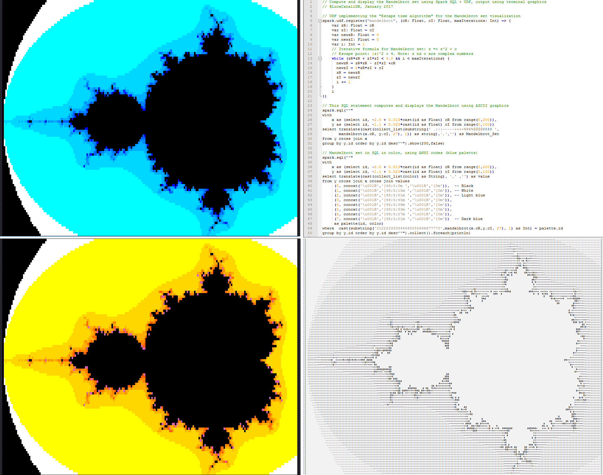

# Examples of Spark SQL with UDF 

Spark SQL and UDF are quite powerful tools for data processing, also in combination with notebooks.
Here are a few "fun" examples to illustrate some of the main techniques with splashy graphics.
 
| Doc                        | Short description
| -------------------------- | -------------------------------------------------------------------------------------
| [**Spark_SQL_UDF_example_Mandelbrot_Python.md**](Spark_SQL_UDF_example_Mandelbrot_Python.md) | Spark SQL + UDF, Mandelbrot set example in Scala
| [**Spark_SQL_UDF_example_Mandelbrot_Scala.md**](Spark_SQL_UDF_example_Mandelbrot_Scala.md) | Spark SQL + UDF, Mandelbrot set example in Python
| [**Spark_SQL_UDF_example_Mandelbrot_Images.png**](Spark_SQL_UDF_example_Mandelbrot_Images.png) | Output images of the Mandelbrot set example
| [**Spark_SQL_UDF_example_notebook_Mandelbrot_Scala_Jupyter_Toree.ipynb**](Spark_SQL_UDF_example_notebook_Mandelbrot_Scala_Jupyter_Toree.ipynb) | Jupyter notebook with Python kernel
| [**Spark_SQL_UDF_example_notebook_Mandelbrot_Jupyter_Python.ipynb**](Spark_SQL_UDF_example_notebook_Mandelbrot_Jupyter_Python.ipynb) | Jupyter notebook in Scala with Apache Toree kernel

References:
- https://github.com/LucaCanali/Miscellaneous/tree/master/SQL_color_Mandelbrot
- https://en.wikipedia.org/wiki/Mandelbrot_set
- https://wiki.postgresql.org/wiki/Mandelbrot_set

Author: @LucaCanaliDB, January 2017
